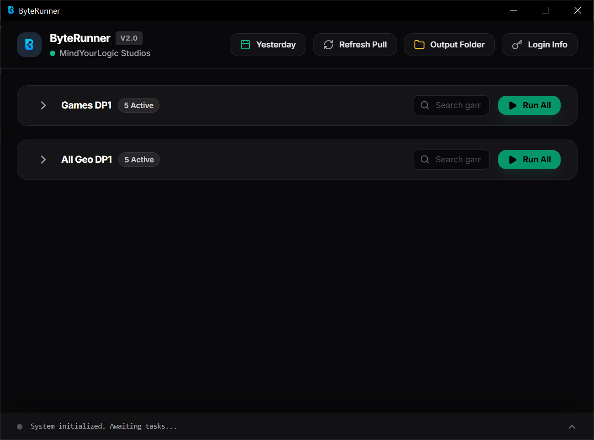
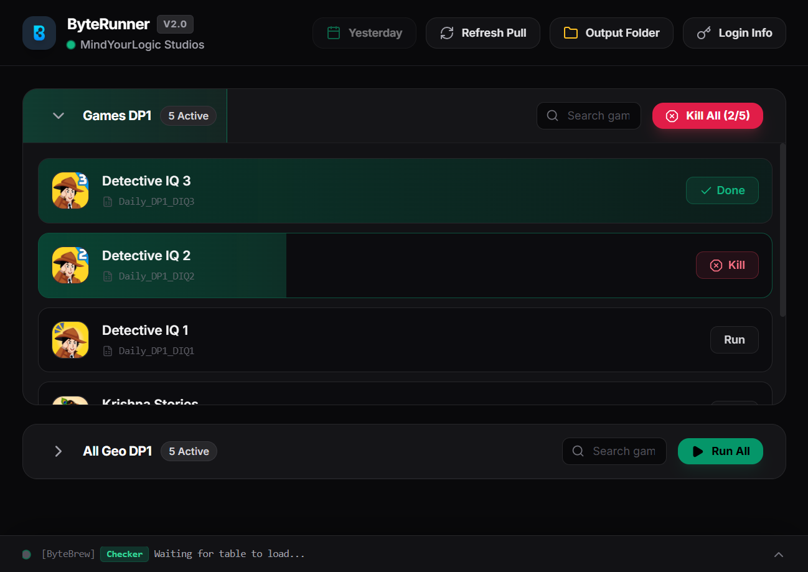

# ByteRunner: ByteBrew DP1 Automation Engine V2.0

ByteRunner is a desktop automation and analytics tool built with Python, PyWebView (Tailwind CSS frontend), and Playwright. It automates cohort configuration, multi-part funnel extraction, and DP1 KPI aggregation for mobile games on the ByteBrew dashboard.

---

## App Preview

### Dashboard Home


### Task Execution in Progress


---

## Features

* **Clicker–Checker State Machine:** Implements action-assertion verification across DOM elements before executing steps to avoid race conditions and network lag.
* **Automated Funnel Extraction:** Navigates Funnel and Mechanic explorers, sets date ranges, configures cohorts, and downloads multi-part datasets.
* **Automated DP1 KPI Reports:** Merges Part A and Part B exports into styled `.xlsx` spreadsheets calculating level progressions, ad views, and average ads per user.
* **Self-Healing API Recovery:** Detects dropped network packets or missing Geo filters in real time and triggers automatic reload loops.
* **Modern Desktop GUI:** Built with PyWebView and a responsive Tailwind CSS interface, featuring a flatpickr calendar date picker, Google Sheets task sync, and local credential storage.

---

## Project Structure

```text
├── app.py                 # Main GUI application & JS bridge
├── bytebrew_downloader.py   # Playwright automation & data processing engine
├── icon.ico                 # Application window and taskbar icon
├── ui/                      # Tailwind CSS frontend directory
│   └── index.html           # Modern dashboard interface
├── assets/                  # Documentation screenshots (home.png, run.png)
├── requirements.txt         # Python dependencies
└── README.md                # Project documentation
```

---

## Installation & Setup

### 1. Clone the Repository
```bash
git clone https://github.com/jephinTJ/byteRunner.git
cd byterunner
```

### 2. Set Up Virtual Environment & Dependencies
```bash
python -m venv .venv
# Windows:
.venv\Scripts\activate
# macOS/Linux:
source .venv/bin/activate

pip install -r requirements.txt
```

### 3. Install Playwright Chromium Browser
```bash
playwright install chromium
```

### 4. Run the Application
```bash
python app.py
```

---

## Building Standalone Executable (.exe)

Compile the application into an optimized directory-based binary using PyInstaller:

```bash
pyinstaller --noconfirm --onedir --windowed --icon="icon.ico" --add-data "ui;ui" --name "ByteRunner" app.py
```

The compiled application folder will be generated inside the `dist/ByteRunner/` directory. Remember to keep the bundled `_internal/` and `ui/` directories alongside the executable.

---

## Output Architecture

* **Excel Reports:** `files/YYYY-MM-DD/<Output_Name>.xlsx`
* **Execution Logs:** `files/YYYY-MM-DD/execution_log_dp1.txt` / `files/YYYY-MM-DD/execution_log_all_geo.txt`
* **Local Credentials:** `System Files/credentials.json` (created on first save)
